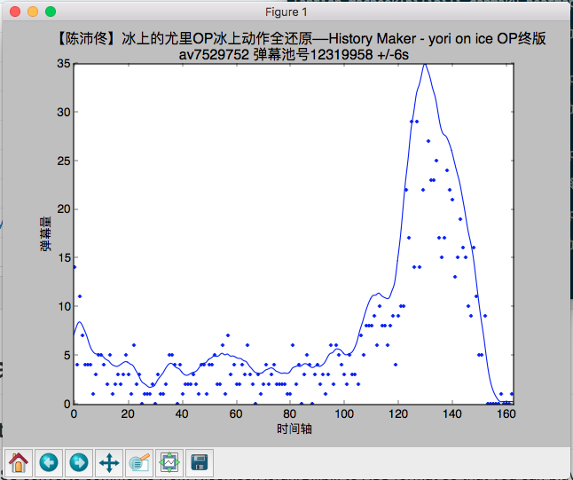

# Bilibili-Danmaku-Heatmap

统计 Bilibili 视频弹幕的分布，快速发现视频讨论热点

# 依赖关系

本软件依赖 Python Requests，NumPy，SciPy，MatPlotLib模块。

如果使用 Python 2，运行`pip install requests numpy scipy matplotlib`

如果使用 Python 3，运行`pip3 install requests numpy scipy matplotlib`

# 使用

下载后运行，按提示操作即可。

如果使用 Python 2，运行`python2 bilibili-danmaku-heatmap.py`

如果使用 Python 3，运行`python3 bilibili-danmaku-heatmap.py`

可以在源代码里修改一些参数，见代码内注释

# 示例
```
lantian-macbook:bilibili-danmaku-heatmap lantian$ python3 b*
? 输入视频 av 号: av7529752
i 视频标题: 【陈沛佟】冰上的尤里OP冰上动作全还原––History Maker - yori on ice OP终版
i 弹幕池号: 12319958
```


